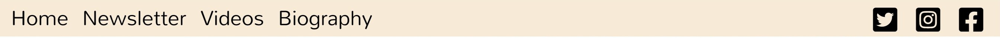
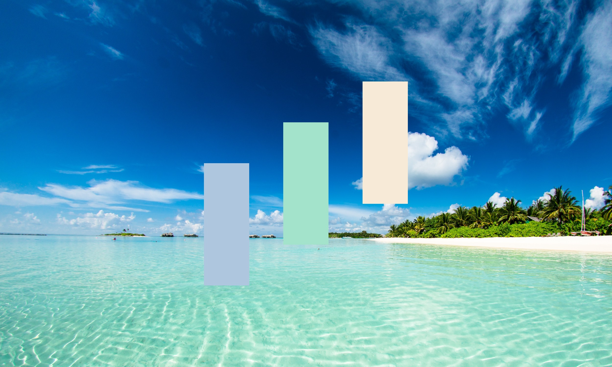
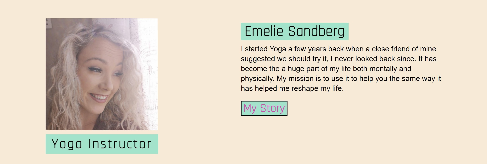
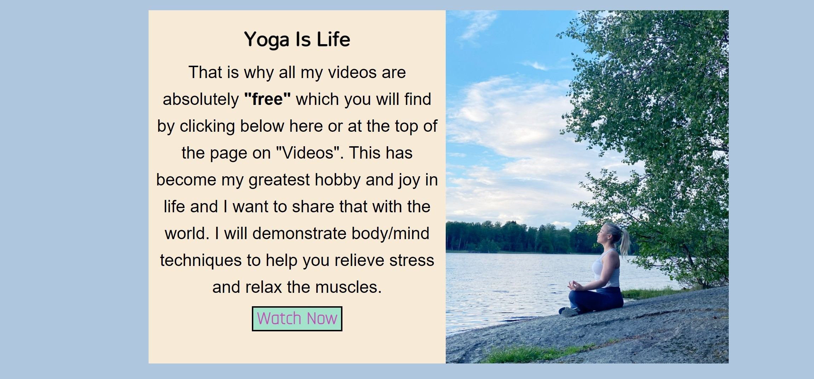

# Yoga-Nature
Is a website intended for audiences that are interested in learning body/mind self-improvement techniques through yoga. This will be done by providing an instructor who is certified in yoga and will demonstrate the self-improvement techniques through recorded videos.  <!--The title needed to coincide with how in tune yoga makes people feel with nature. I then needed to reflect that right away by having my ([Hero Image](https://www.pexels.com/photo/photo-of-blue-sea-1430677/)) present such an environment. The website is intended for public use so there is no need to **"pay"** a subscription in order to sign up for the courses. Considering the times we are living in where people are working remotely from home and keeping a distance provided a great oppotunity to teach yoga from the comfort of your mobile or laptop device.-->

<!--I have used the website ([Pexels](https://www.pexels.com/)) for all the images on my website except the ones that I own myself which are of the 'yoga instructor' Emelie Sandberg. "Pexels" provides free stock photos and videos for public use. The images of Emelie Sandberg were taken by me personally and the demonstration videos were also recorded by me. I have full rights to use the images and videos from her for this project as she has allowed me. She is also an acrobatic artist who has her own website for bookings at 

([Emelie Sandberg](https://www.emeliesandberg.se/))-->

## Features

### Existing Features

* Navigation bar across all links of the website
* A footer page across all pages that display a sign-up form
<!--Add footer image when completed-->

## The Landing Page Image 

* ### Logo
    * The landing page I needed to coincide with the logo by connecting yoga to nature. I chose an image of a beach. The colors bring a sense of relaxation and calmness. 

* ### Cover-Text
    * The cover-text is meant to catch the users attention upon arriving to the page and adhere their consciousness as to why this should be their go to yoga page.

<!--## Colors

* I then had a color palette created on (**[coolors](https://coolors.co/)**). This was done by uploading the image and having it choose a palette which I can then adjust to my liking. This is the result I settled with in the end.

* The colors from left to right in hexadecimal are as follows. 
    1. #aec6de
    2. #a3e3cb
    3. #f7ead7-->

<!--## Logo

* My logo is text based only with the title "Yoga Nature" which is representative by the background image. I chose font-family "Rajdhani" to be the main text for the logo. It is visually pleasing to the eye and I kept it black because no matter the changes the back drop may get the visual of the text remains intact. I also added a rectangler box around the text to add more depth to the lettering.

* It was important that I applied a cover text to the hero-image so that when the user enters the site they will not only see the logo and the backdrop that is warm and welcoming but also understand the purpose of Yoga Nature. My goal with the cover text was to do three very important things that will make the user attract 

-->

* ## Me Section
    * This section is about the (Yoga Instructor) **Emelie Sandberg**
    * It provides a snippet of information about her with a hyperlink to her biography that can also be find in the navigation bar

* ## Yoga-Course Section
    * This section is a brief intro that connects the user to the video part of the page by providing a small summary of text 
    * The selling point for the audience is that the course vidoes are **free** which is what will grasp their attention the most

* ## Footer
    * My current footer page only has a Newsletter sign-up form. The reason for this is because I have my social-media tabs at the top of the page so there was no reason to include them again at the bottom
    *  Since the location functions remotely there was no need to include an address

