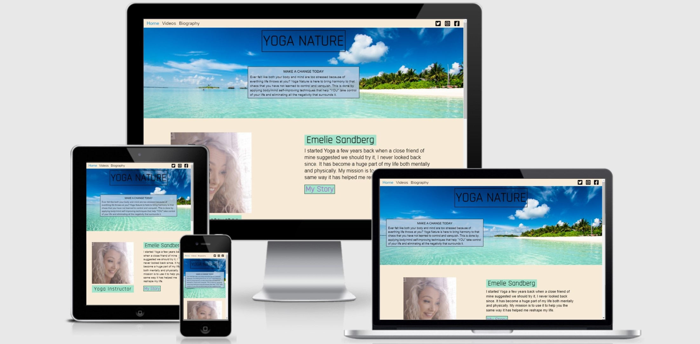

# Yoga Nature

Is a website intended for audiences that are interested in learning body/mind self-improvement techniques through yoga. This will be done by providing an instructor who will demonstrate the self-improvement techniques through recorded videos.  

You can visit the deployed website [here](https://champion316.github.io/Yoga-Nature/).

## 1. UX

#### 1.1. Project Goals

This website was designed for individuals all over the world that are interested in learning yoga for free without paying for classes. The instructor is very knowledgeable and teaches for the passion. Videos will be posted weekly with new material which is how you keep an audience coming to the website. 

#### 1.2. User Stories

- As an instructor, I want to be able to get as much people intersted.
- As an instructor, I want word of mouth to spread.
- As an instructor, I want people to do yoga in their own time without me there.
- As a person, I would like to know about the instructor.
- As a person, I would like to contact the instructor if I have any questions.
- As a reguar customer, I want more material to keep me coming to the website.
- As a potential client, I would like to attempt a few of the course videos to see how it makes me feel.
- As a potential client, I want to know if this really benefits my overall health.

<!--FINISH THE WIREFRAMES-->

## 2. Features

### 2.1. Existing features

**The Header** includes:

- **Websites Name**: allows the user to know that they are in the main page.
- **Navigation Bar**: allows users to navigate with simplicity.
- **Social**: allows users to easily identify other platforms where they can learn more about the business or the owner herself.
- **Logo**: allows users to feel attuned with body and mind when performing yoga.

**The Footer** includes:

- **Contact Details**: includes a contact email to contact the owner.
- **Sign-up Form**: Newsletter so clients can stay up to date with new material and more.

Header and Footer appear on every page of the website.

**Home Page** includes:

- **My Story Button**:users learn a little about the instructor and are taken to the biography page as well.
- **Learn More**: this is where users will learn for the first time that all course videos will be absolutely FREE!
- **Sign-up Form**: allows users to sign-up for weekly updates to the lastest videos and any news relating with the world of yoga.

**Video Page** includes:

- **Lessons**: well formatted videos where the user can view them on the owners page with the name of each lesson. 
- **Sign-up Form**: is always at the bottom of each page for when the user is ready to commit to the newsletter.

**Biography Page** includes:

- **Brief History**: about the instructors life, who she is and how she got here.
- **Sign-up Form**: is always at the bottom of each page for when the user is ready to commit to the newsletter.

### 2.2. Features left to implement in the future

- Add sections that will separate the videos as the libray grows by dates and categories.
- Be able to submit the form and receive a confirmation when signing up for the newsletter.
- Add a featured page for testimonials on clients that have experienced positive changes.
- Add a section with testimonials and customers' reviews.

---

## 3. Technologies used

- [HTML5](https://en.wikipedia.org/wiki/HTML5) - provides the content and structure for the website.
- [CSS3](https://en.wikipedia.org/wiki/Cascading_Style_Sheets) - styling for my website.
- [Balsamiq](https://balsamiq.com/) - used to create the project's wireframes.
- [Gitpod](https://gitpod.io/) - used to develop the website in the beginning. 
- [Visual Studio Code](https://code.visualstudio.com/download) - used to develop the website outside of Gitpod.
- [GitHub](https://github.com/) - used to host the project.
- [Google Fonts](https://fonts.google.com/) - used to provide my fonts (font-family: 'Mallanna', 'Rajdhani')
- [Font Awesome](https://fontawesome.com/) - used font awesome to add and emoji to the 'sign-up form' in the footer.
- [Pexel](https://www.pexels.com/) - used to get the hero image of the beach in the header.
- [Am I Responsive?](http://ami.responsivedesign.is/) - used to present the site on different devices.
- [HTML Validator](https://validator.w3.org/) - used to find errors that don't belong in my HTML code.
- [CSS Validator](https://jigsaw.w3.org/css-validator/) - used to find erros that don't belong in my CSS code.

## 4. Testing

The testing process can be seen [here](TESTING.md).

## 5. Deployment

**To deploy the project**

This project is hosted in GitHub Pages

1. On the menu on the top of the project’s repository on GitHub select **Settings**.
2. Scroll down to the GitHub **Pages** section.
3. Inside that section, click on the drop-down menu under **Source** and select **Main Branch**.
4. The page refreshes automatically and the website is now deployed.
5. The link to the webpage is just in the GitHub **Pages** section down below.

Only one branch has been used for this project.

**To run the project locally**

To clone this project from GitHub:

1. Under the repository’s name, click **Clone or download**.
2. In the **Clone with hTTPS** section, copy the given URL.
3. In your IDE of choice, open **Git Bash**.
4. Change the current working directory to the location where you want the cloned directory to be made.
5. Type **git clone**, and then paste the URL copied from GitHub.
6. Press **enter** and the local clone will be created.

---

## 6. Credits

### 6.1. Content
The website and and written text was mostly done by me alone. 

### 6.2. Media

The images of the yoga-instructor were taken by me personally since she is my wife and it just so happened that there was a yoga project involved. This is her personally website not designed by me. 

[Emelie Sandberg](http://www.emeliesandberg.se/)