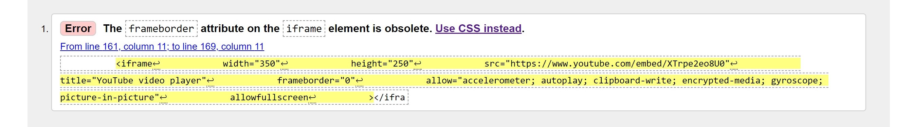
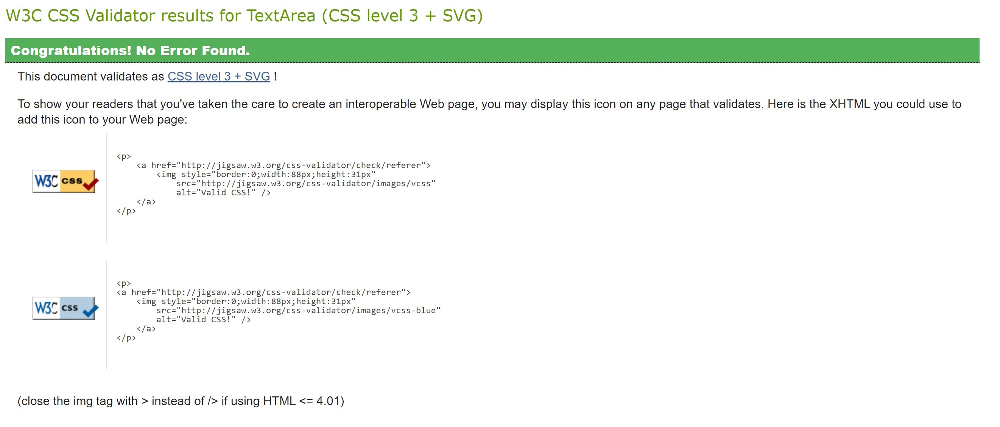

# Testing

## Code validators

[HTML Validator](https://validator.w3.org/) : 

- Home Page

The test returned no errors, at the time of this test.

Prior to this test I had errors for having ***alt=""*** on my nav links.

- Video Page

No errors only the same error I had with the Home Page on all nav links.

- Biography Page

No errors only the same error I had with the Home Page on all nav links.

[CSS Validator](https://jigsaw.w3.org/css-validator/) :

The test found 8 of the same error, I left one error on the image since I started to work on it prior to the screen show. 

The error is that frameborder is not a supported attribute anymore instead it is now style="border:0;"

I went and changed that attribute on all of my videos. 

Upon fixing the I got a pass on the CSS Validator testing.

## Responsiveness

* To test the responsiveness of the site I used 
    * [Chrome DevTools](https://developers.google.com/web/tools/chrome-devtools)
    * [FireFox DevTools](https://developer.mozilla.org/en-US/docs/Tools)
    * [Microsoft Edge](https://developer.microsoft.com/en-us/microsoft-edge/tools/)

Notes:

- The design is responsive in most screen sizes.

- Upon discovering Responsive Checker I discovered overflow issues with other devices when dipping below certain measurements.

[Responsive Checker](https://www.responsivedesignchecker.com/)

- The overflow would occur 
    1. index.html ***yoga-course*** section between the 2 divs that sit together or a slightly a part depending on device.
    
    2. biography.html when dipping below the 700px in width.

**Monitors**

- I witnessed overflow with screen sizes on monitors going under 1440x900
    - With "Responsive Checker" that would be starting at 15 "Notebook 1366x768 and below.

** Tablets** 

- When responding to the Nexus 7 which is 600x960 both sections I mentioned above overflow.
    1. In biography.html the paragraph text vanishes
    2. In index.html the **yoga-course** has an overflow issues because of the 2 divs and their sizes and margin.

**Phones**
- The Phones were the best of the 3 devices. Just a little overflow from text within the cover-text div.
    1. Issue starts with the iPhone 3/4/4s dimensions of 320x480
    2. iPhone 5/5s

## Browser compatibility

Notes:

- I rigorously tested on the 3 most known browsers: 
    * [Chrome](https://www.google.com/chrome/)
    * [FireFox](https://www.mozilla.org/en-US/firefox/new/)
    * [Microsoft](https://www.microsoft.com/en-us/edge)

- All browsers run the webpage great, only issue is the yoga-course section in the Home Page.
    * With standard sizing for devices it runs great
    * Upon minimizing the window the image overflows to the bottom.
        * On mobile I have removed this image for this reason but on tablets and monitors it would leave too much of an empty space.

## Testing User stories

### First Time Visitor Goals

-  As a first time visitor I want to know what makes this yoga page different than any other.
    1. Is the person teaching very knowledgable?
    2. Is the material easy to follow?
    3. What is the price for the courses?

- As a first time visitor can I navigate the page?
    1. The nav-bar at the beginning of the page makes it simplistic to find all sections of the website.
    2. Every section of the nav-bar can be found in the index.html page separated by sections that give a small description of the nav-links.

- As a fist time user I want to know the background of the person teaching
    1. The biography provides great detail into the personal life of the instructor
    2. The videos and the comfort in which the instructor explains her material are representative of her experience

 #### Returning Visitor Goals 

- Connect with the material being taught.
    1. Great informative material
    2. Modern with the times 
    3. Clear explanation

#### Frequent User goals 

- What is the material/courses doing for my health?
    1. Has my health improved?
    2. Does the material expand beyond 2-3 body parts? 

- Does the material stay true to the theme of body/mind techniques? 
    1. Has my mental health improved?
    2. Has my physical health improved?
    3. Am I better than I was before I started?

### Known Bugs

- On mobile device I would get white gap on the right side of the page 
    - Issue most likey stemmed from a large hero-image and floating issues on mobile

- One of the biggest issues I encountered later in my development process was text-alignment issues after the menu container.
    
    - Any section or div that came after the container at the top would push the text away from the left side of the screen and somewhere closer to the middle on the left side upper screen.  
        1. In the beginning I thought it was because I had my container in sticky.
        2. I tried position absolute and the issue still occured.
        3. I settled with position: static, but the issue persisted
        4. Luckily none of my pages required text at the left upper corner after id="container"

- On media devices in videos.html #videos-background has an overflow: auto which causes a thin line to appear when it meets with the footer.
    
    - Already so late in the development and for the sake of not creating more bugs with the other media devices that were already completed.
        1. I created a class="black-top-border" and used it on all media devices to cover the appearing line when scrolling to the bottom. 

        2. This was only done in the ***video page*** of all devices.

- The first section in the index.html page titled id="yoga-course" has two children divs that sit next to one another. Depending on the devices size the div on the right wold overflow to the bottom. 

    - I used extensive media queries to fix this issue as best as I could but it was not possible with all devices.
        1. On mobile I eliminated the image which fixed the issue entirely.
        2. On PC and tablets I coded it to fit the iPad/iPad Pro and certrain monitor sizes.

[Return to README.md file](README.md).
